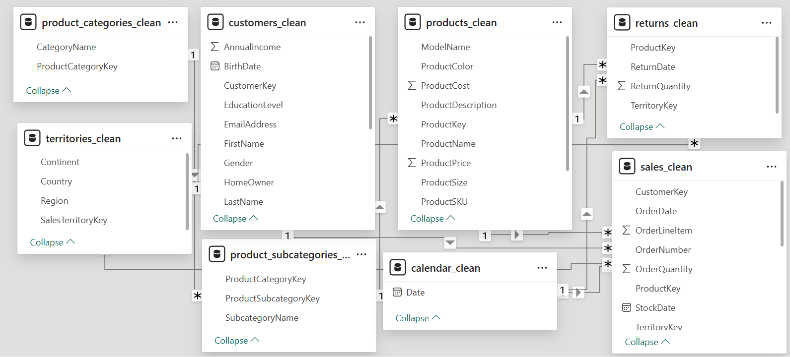
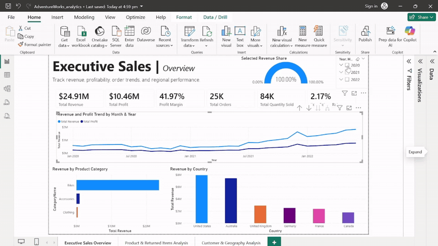
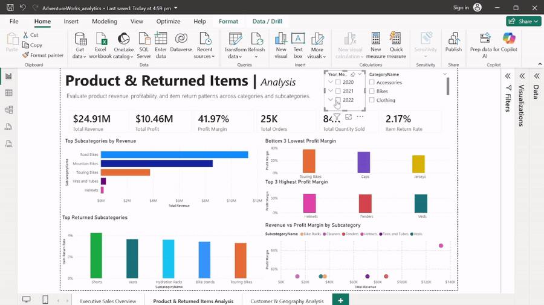
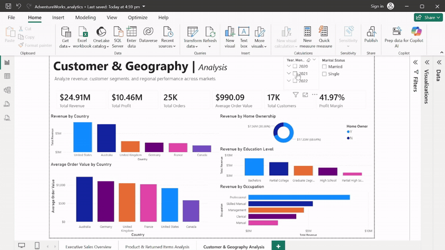

# AdventureWorks Power BI Sales Dashboard

## Project Overview

This project demonstrates an end-to-end business intelligence workflow using AdventureWorks sales data. The workflow includes cleaning and validating raw CSV files with Python/pandas in Jupyter Notebook, preparing the data for analysis, building a relational data model in Power BI, creating DAX measures, and designing an interactive dashboard for business reporting.

The goal of this project was to transform multiple related raw data files into a clean, model-ready dataset and use Power BI to help users understand sales performance, profitability, customer patterns, and returned item behavior.

## Dashboard Preview

The Power BI dashboard contains three report pages: Executive Sales Overview, Product And Returned Items Analysis, and Customer And Geography Analysis.

### Executive Sales Overview

### Product And Returned Items Analysis

### Customer And Geography Analysis

## Business Questions

This dashboard answers the following questions:

- How are revenue, profit, order volume, and item return rate performing over time?
- Which product categories and subcategories generate the most revenue?
- Which subcategories have stronger or weaker profit margins?
- Which subcategories have the highest item return rates?
- Which countries generate the most revenue?
- Which customer groups contribute most to sales performance?

## Tools Used

- Excel
- Python / pandas
- Jupyter Notebook
- Power BI
- DAX
- AI-assisted reporting

## Data Source

This project uses the [Adventureworks Dataset for Data Analysis](https://www.kaggle.com/datasets/shaikhshoeb/adventureworks-dataset-for-data-analysis) from Kaggle.

## Dataset Overview

The project uses multiple AdventureWorks CSV files:

- Calendar lookup
- Customer lookup
- Product lookup
- Product category lookup
- Product subcategory lookup
- Sales data from 2020 to 2022
- Returns data
- Sales territory lookup

The sales files from 2020, 2021, and 2022 were combined into one sales table before being loaded into Power BI.

## Data Cleaning Summary

The data was reviewed and cleaned using Python and pandas before dashboard development.

Key cleaning steps included:

- Loaded and audited all raw CSV files.
- Combined yearly sales files into one sales table.
- Checked row counts, missing values, duplicate rows, and key fields.
- Removed invalid customer rows that contained export metadata instead of valid customer records.
- Converted customer keys into numeric format after validation.
- Replaced missing customer text fields with `Unknown`.
- Left numeric fields such as income and total children blank where values were missing, to avoid creating misleading numeric values.
- Replaced missing product color values with `Unknown`.
- Exported cleaned tables for Power BI use.

During review, a text encoding issue appeared when viewing names in Excel. The data was checked in pandas to confirm whether the issue was in the data itself or caused by how Excel displayed the CSV. Cleaned CSV exports used UTF-8 with BOM encoding to improve compatibility with Excel and Power BI.

## Data Model

The Power BI model uses a star-schema style structure with sales and returns as fact tables and lookup tables for descriptive fields.

Main fact tables:

- `sales_clean`
- `returns_clean`

Main lookup tables:

- `calendar_clean`
- `customers_clean`
- `products_clean`
- `product_categories_clean`
- `product_subcategories_clean`
- `territories_clean`

The model connects sales and returns to shared lookup tables such as products, territories, and calendar dates. This allows dashboard filters and visuals to work across multiple business areas.

Examples of relationships include:

- `sales_clean[ProductKey]` to `products_clean[ProductKey]`
- `sales_clean[CustomerKey]` to `customers_clean[CustomerKey]`
- `sales_clean[TerritoryKey]` to `territories_clean[SalesTerritoryKey]`
- `returns_clean[ProductKey]` to `products_clean[ProductKey]`
- `returns_clean[TerritoryKey]` to `territories_clean[SalesTerritoryKey]`

## DAX Measures

The dashboard uses DAX measures for the main business metrics instead of relying only on raw columns.

Key measures include:

- Total Revenue
- Total Cost
- Total Profit
- Profit Margin
- Total Orders
- Total Quantity Sold
- Total Return Quantity
- Item Return Rate
- Average Order Value
- Total Customers
- Selected Revenue Share

Using DAX measures makes the dashboard interactive, because the metrics update when users apply slicers or click visuals.

## Dashboard Pages

The dashboard contains three pages covering executive performance, product and returned item analysis, and customer/geography insights.

### 1. Executive Sales Overview

This page provides a high-level view of sales performance.

It includes:

- Total revenue
- Total profit
- Profit margin
- Total orders
- Total quantity sold
- Item return rate
- Revenue and profit trend over time
- Revenue by product category
- Revenue by country
- Selected revenue share gauge

### 2. Product And Returned Items Analysis

This page focuses on product performance, profitability, and returned item patterns.

It includes:

- Top subcategories by revenue
- Highest item return rate by subcategory
- Lowest profit margin subcategories
- Highest profit margin subcategories
- Revenue vs profit margin by subcategory

### 3. Customer And Geography Analysis

This page focuses on customer and market performance.

It includes:

- Revenue by country
- Average order value by country
- Revenue by home ownership
- Revenue by education level
- Revenue by occupation
- Customer and market filters

## Key Insights

The dashboard shows the following verified insights:

- Total revenue was `$24.91M`, with total profit of `$10.46M` and a profit margin of `41.97%`.
- Revenue and profit generally increased from 2020 to 2022, with stronger monthly performance appearing in 2022.
- Bikes generated the majority of revenue, showing that the business is heavily dependent on bike sales compared with Accessories and Clothing.
- The United States and Australia were the highest revenue countries.
- Road Bikes generated the highest revenue among product subcategories.
- Shorts had the highest item return rate among the displayed subcategories, followed by Vests, Hydration Packs, Bike Stands, and Touring Bikes.
- Australia had the highest average order value by country.
- Homeowners contributed more revenue than non-homeowners.
- Customers with a Bachelor's degree generated the highest revenue by education level.
- Professional customers generated the highest revenue by occupation.

## Recommendations

- Continue monitoring Bikes as the primary revenue driver, while reviewing whether Accessories and Clothing can be grown through cross-selling.
- Investigate high item return rate subcategories such as Shorts and Vests to understand whether returns are caused by sizing, product quality, or customer expectations.
- Review profitability differences across subcategories to identify products with strong margins but lower revenue potential.
- Explore why Australia has the highest average order value and whether similar customer behavior can be encouraged in other countries.
- Use customer segment patterns such as occupation, education level, and home ownership to support more targeted marketing analysis.

## AI-Assisted Reporting

AI was used as a reporting assistant to help summarize verified Power BI dashboard metrics into concise business language.

The AI assistant was not used to clean, modify, or calculate the dataset. All calculations were completed using pandas or Power BI measures, and insights were based only on verified dashboard outputs.

To reduce the risk of hallucinated insights, a controlled prompt was used that instructed the AI assistant to only summarize metrics explicitly provided by the analyst.

The controlled AI prompt is documented here: [`notes/ai_dashboard_summary_prompt.md`](notes/ai_dashboard_summary_prompt.md).

## Limitations

This dashboard identifies patterns in sales, profitability, customer groups, and returned item behavior. However, it does not fully explain the causes behind every pattern.

Further analysis could be improved with additional data such as:

- Marketing campaign data
- Customer acquisition source
- Customer lifetime value
- Product inventory levels
- Shipping and logistics cost
- Customer satisfaction or review data

## Final Deliverables

This project produced the following deliverables:

- Cleaned CSV tables
- Jupyter Notebook data cleaning workflow
- Power BI dashboard file: `AdventureWorks_analytics.pbix`
- Dashboard GIF walkthroughs and screenshots
- Power BI data model screenshot
- AI dashboard summary prompt
- Portfolio README

## Conclusion

This project demonstrates a complete Power BI analytics workflow: preparing data with Python, building a relational data model, creating DAX measures, designing a multi-page dashboard, and translating verified dashboard metrics into business-focused insights.

The project highlights practical business intelligence skills including data cleaning, data modeling, dashboard design, DAX, interactivity, and responsible AI-assisted reporting.
